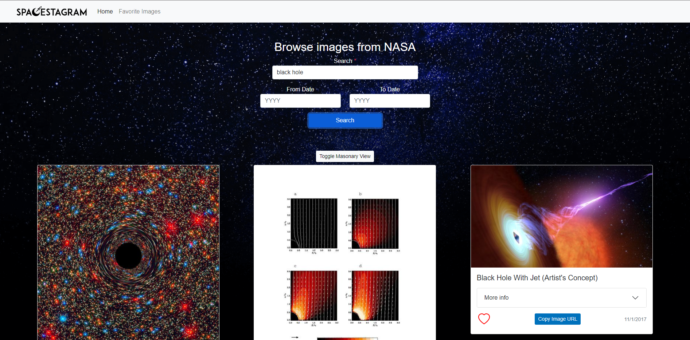

# Spacestagram

## About

Spacestagram helps users explore images from nasa pets across cities and towns. [Explore Spacestgram](https://mohmedvaid.github.io/spacestagram/)<br /> Please let me know if you see extra extra terrestrial! <br />


## Table of Contents

- [Installation](#installation)
- [Usage](#usage)
- [API](#api)
- [Technology](#technology)
- [License](#license)

## Installation

Clone or Fork the [Spacestagram repo](https://github.com/Mohmedvaid/spacestagram) and navigate to the project's root folder in your terminal, run the following command to install dependencies:

```
npm install
```

Run the following command at the project's root folder:

```
npm start
```

Spacestagram should now be running locally at http://localhost:3000

## Usage

1. Navigate to [Spacestgram](https://mohmedvaid.github.io/spacestagram/) and search for keywords like "Stars" or "black hole"<br />

2. Masonary view can be toggeled via Masonay Toggle button for better view

## Tests

Currently there are no unit tests

## Technology

| Frontend  
| ------------
| React  
| Bootstrap  
| Axios

## API

[NASA Image and Video Library](https://api.nasa.gov/#:~:text=images.nasa.gov-,NASA%20Image%20and%20Video%20Library,-Use%20this%20API)

## License

[](https://opensource.org/licenses/MIT)

[Back To Top](#spacestagram)
